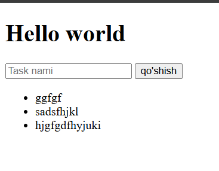

# uyga-vazifa-edi_
project qilamiz
# 🚀 Flask Project – Database Example

Ushbu loyiha **Flask** asosida yaratilgan va yangi o‘rganayotganlar uchun **eng sodda va tushunarli** shaklda yozilgan.  
Loyihada so‘zlar bazasi bilan ishlash, formalar orqali ma'lumot qidirish va qo‘shish kabi amaliy funksiyalar mavjud.

---

## 📸 Loyihadan namunalar



---

## 📂 Loyiha tarkibi

flask-project-database-example/
│
├── app.py # Asosiy Flask dastur
├── templates/
│ └── index.html # Asosiy UI (tarjimon)
├── static/ # Statik fayllar (rasmlar, css, js)
├── example.png # UI ekran rasmi
└── README.md # Ushbu hujjat


---

## ⚙️ O‘rnatish va ishga tushirish

Quyidagi qadamlar orqali loyihani ishga tushirishingiz mumkin:

### 1️⃣ Virtual muhit yaratish (ixtiyoriy, lekin tavsiya etiladi)

```bash
python -m venv venv
source venv/bin/activate   # Linux / MacOS
venv\Scripts\activate      # Windows

2️⃣ Kerakli kutubxonalarni o‘rnatish
pip install -r requirements.txt


Agar requirements.txt bo‘lmasa:

pip install flask

3️⃣ Dastur ishga tushiriladi
python app.py


Keyin brauzerda oching:

http://127.0.0.1:5000
# 🚀 Flask Project – Database Example

Ushbu loyiha **Flask** asosida yaratilgan va yangi o‘rganayotganlar uchun **eng sodda va tushunarli** shaklda yozilgan.  
Loyihada so‘zlar bazasi bilan ishlash, formalar orqali ma'lumot qidirish va qo‘shish kabi amaliy funksiyalar mavjud.

---

## 📸 Loyihadan namunalar


---

## 📂 Loyiha tarkibi

flask-project-database-example/
│
├── app.py # Asosiy Flask dastur
├── templates/
│ └── index.html # Asosiy UI (tarjimon)
├── static/ # Statik fayllar (rasmlar, css, js)
├── example.png # UI ekran rasmi
└── README.md # Ushbu hujjat


---

## ⚙️ O‘rnatish va ishga tushirish

Quyidagi qadamlar orqali loyihani ishga tushirishingiz mumkin:

### 1️⃣ Virtual muhit yaratish (ixtiyoriy, lekin tavsiya etiladi)

```bash
python -m venv venv
source venv/bin/activate   # Linux / MacOS
venv\Scripts\activate      # Windows

2️⃣ Kerakli kutubxonalarni o‘rnatish
pip install -r requirements.txt


Agar requirements.txt bo‘lmasa:

pip install flask

3️⃣ Dastur ishga tushiriladi
python app.py


Keyin brauzerda oching:

http://127.0.0.1:5000
